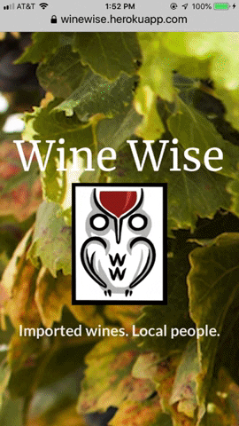

# Wine Wise

[Wine Wise](https://winewise.herokuapp.com/) is a local Bay Area company that imports wines from 55 producers in select countries in Europe and distributes throughout California. All the statistics and information on this website is direct from Producers and the Principals themselves. This is a content management system (CMS) built for Wine Wise.

## Imported Wines. Local People.

## Technologies Utilized

- CSS3
    - Semantic-UI 2.4.1
- JavaScript
    - Node.js
        - Axios
        - Express
        - Express-JWT
        - Fast-CSV
        - JSONwebToken
        - Mongoose
        - React
        - React-Dom
        - React-Router-Dom
- Database
    - MongoDB
- Deployment
    - Heroku

## Mobile Responsive

## Author(s)
  - :cookie: [Elaine Cadman](https://github.com/Gunnem) _(Concept / Project Management)_
  - :green_apple: [Brett Byars](https://github.com/FyperTheViper) _(Back-end / Logo Design / React Execution)_
  - :coffee: [Ajay Paladugu](https://github.com/akp28) _(Log-in / Deployment)_
  - :chocolate_bar: [Susye Weng-Reeder](https://github.com/eveasian88) _(Front-End / Design / React Execution)_
  - :tophat: [Michael Whittemore](https://github.com/michaelwhittemore) _(React Execution/ Database Integration)_